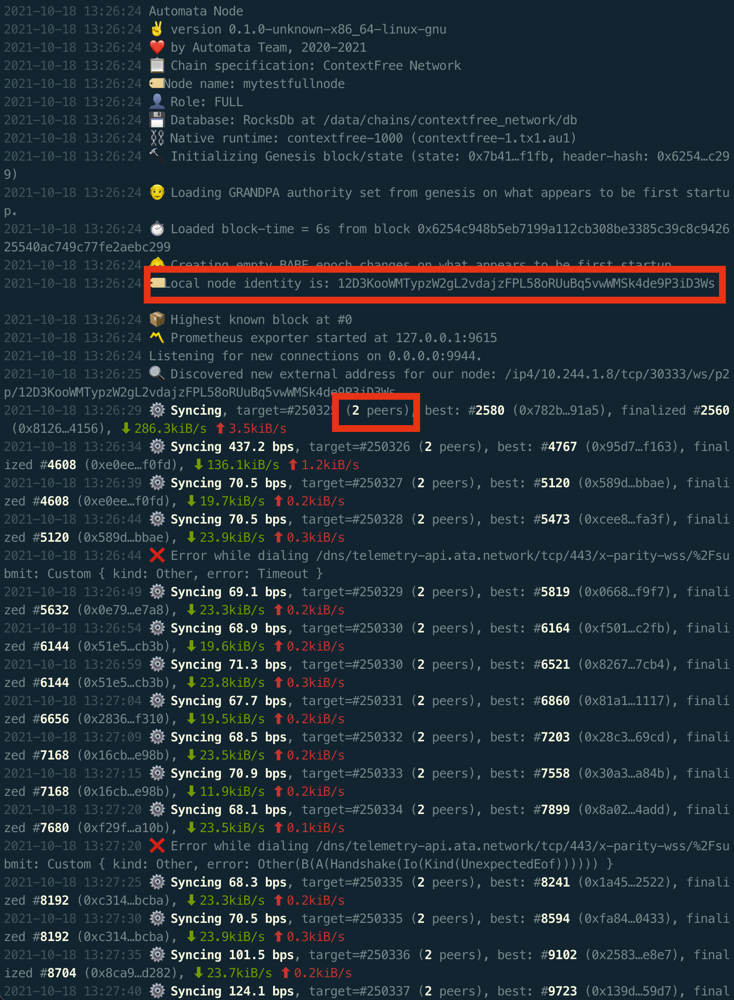

# Run Full Node
## Introduction
According to description in [Type of Nodes](./node-type.md), you can run Full Node, Archive Node or Validator Node on ContextFree Network.<br>
In this section, we briefly introduce how to run `Full Node` or `Archive Node`<br>
For running `Validator Node`, please refer to the [next section](./run-validator.md).

## Preparation
### Dependencies
- Install Docker
  - Please go to [this link](https://docs.docker.com/get-docker/) to download the docker engine for your Operating System accordingly.
### Create a Local Directory To Store the Chain Data
- You may need `sudo` permission to run the following commands.
  - Firstly create a folder to store the synchronized on-chain data
    ```
    mkdir /chain
    ```
  - Change the ownership and permission of your local storage directory to current user
    ```
    sudo chown -R $(id -u):$(id -g) /chain
    ```
## Launch Node
### Launch Full Node
- Run the following command to launch a Full Node, you may need `sudo` permission:
  ```
    docker run -it \
    -v "/chain:/data" \
    -u $(id -u ${USER}):$(id -g ${USER}) \
    -d \
    atactr/automata:contextfree-v0.1.0-rc4 \
    --node-type full \
    --name <YOUR_NODE_NAME>
  ```
  - Which will return the **c_ontainer ID** of your node
  - `<YOUR_NODE_NAME>` can be anything, but it's recommended to have something unique to make it easier to identify your node.

### Launch Archive Node
- Run the following command to launch a Archive Node, you may need `sudo` permission:
    ```
    docker run -it \
    -v "/chain:/data" \
    -u $(id -u ${USER}):$(id -g ${USER}) \
    -d \
    atactr/automata:contextfree-v0.1.0-rc4 \
    --node-type archive \
    --name <YOUR_NODE_NAME>
    ```
  - Which will return the **container ID** of your node
  - `<YOUR_NODE_NAME>` can be anything, but it's recommended to have something unique to make it easier to identify your node.

## Check Launch Status
- Check whether your node downloading blocks by checking the logs
  ```
  docker logs --follow <YOUR_CONTAINER_ID>
  ```
- If it works fine, the beginning of the log should look like<br>
{width="673" height="463"}<br>

  - **Take note of your node identity behind `"Local node identity is: ..."`.** This will be very important for identifying your node on the Telemetry, as the node name can be duplicated.
  - Notice that you should have a **non-zero** number of `"peers"` connected as shown in the image above.
  - If the logs saying `"Error while dialing /dns/..."`, don't be panic, normally it may take a few minutes for the node to connect to the Telemetry server, after that the error will stop popping up.
