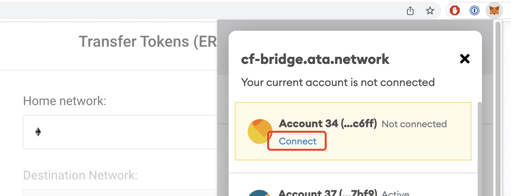
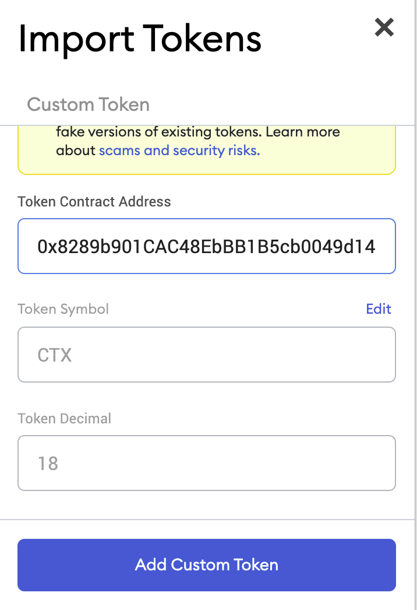
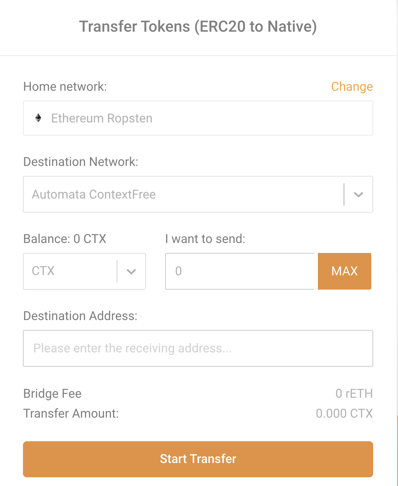
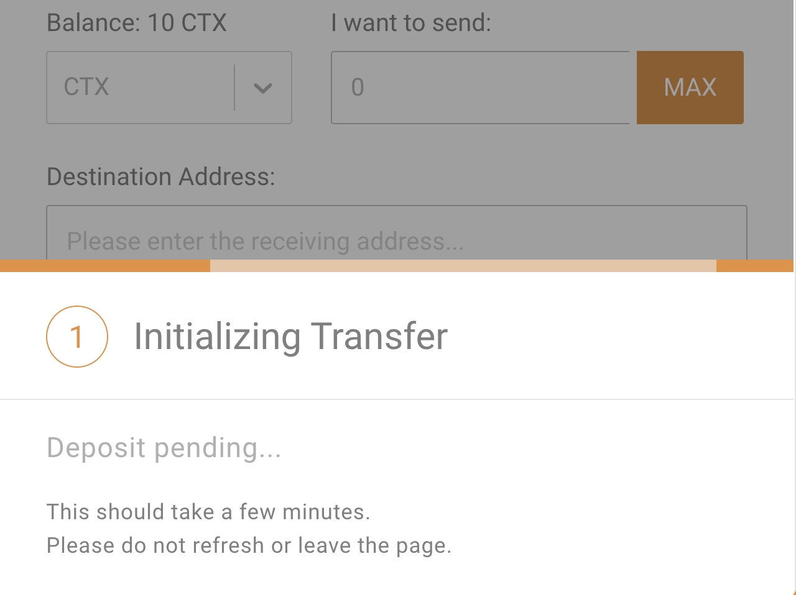
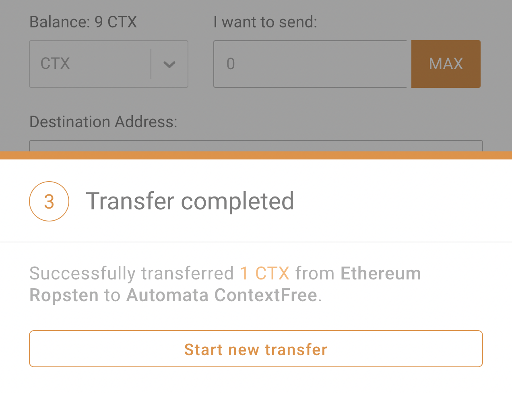
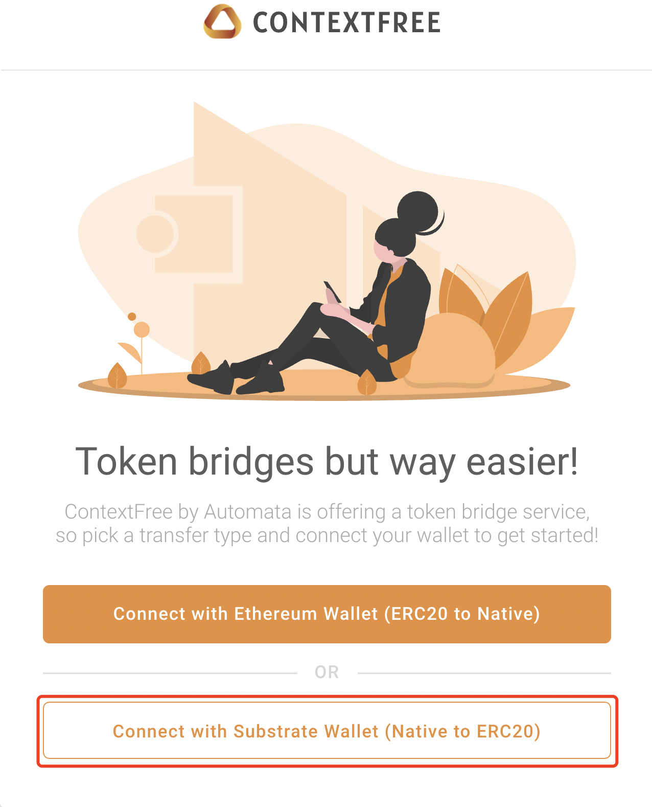
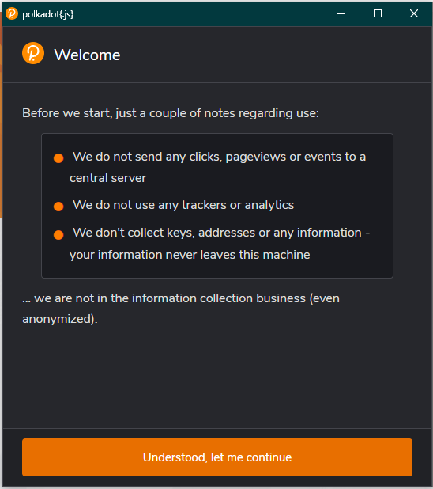
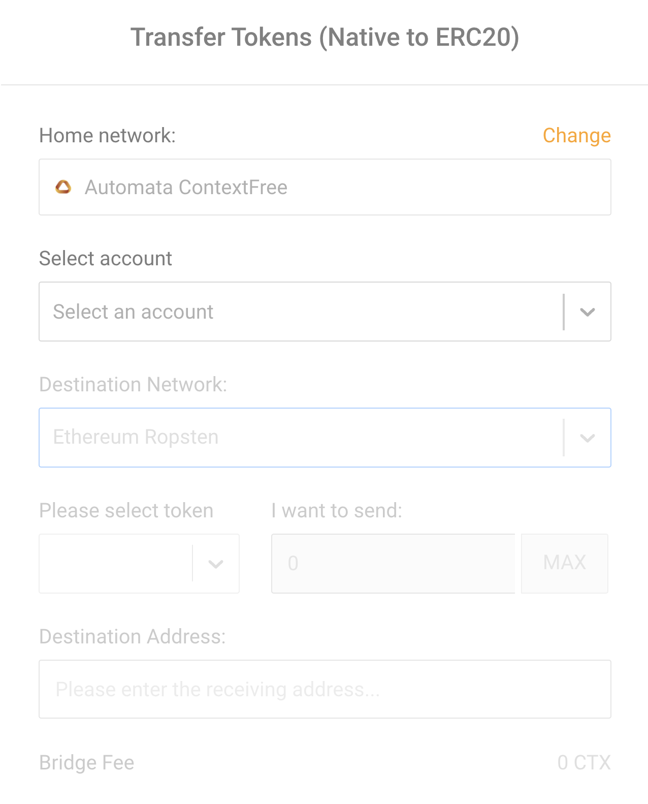
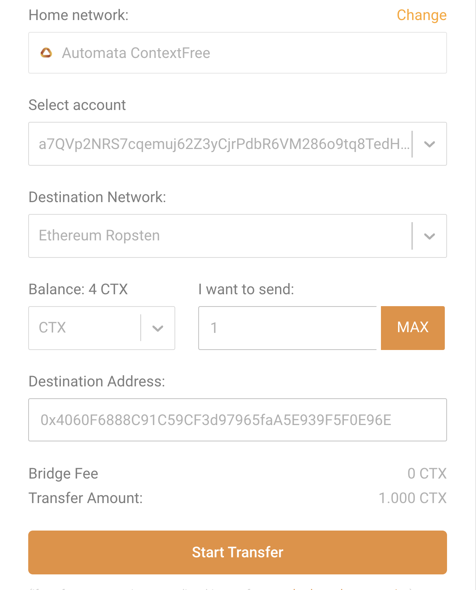

# Automata ContextFree Token Bridge Tutorial
## Introduction
A cross-chain bridge is a connection that allows the transfer of tokens from one chain to another. Both chains can have different protocols and rules, but the bridge provides a compatible way to interoperate securely on both sides. 
The Automata team has set up a cross-chain token bridge for ContextFree between EVM (**Ropsten testnet**) and Substrate-based chains(**ContextFree canary network**) by adopting one of the currently available solutions [**ChainBridge**](https://github.com/ChainSafe/ChainBridge) built by [**ChainSafe**](https://chainsafe.io/).

## Tutorial
### Transfer ERC20 Token to Native Token
#### Preparation
- To use the Automata Token Bridge, please ensure your explorer is Chrome and the following is installed:
  - [Metamask Wallet Extension](https://chrome.google.com/webstore/detail/metamask/nkbihfbeogaeaoehlefnkodbefgpgknn?hl=en)

- Visit [Automata Token Bridge](https://cf-bridge.ata.network/).

#### Set Up MetaMask
- Click `Connect with Ethereum Wallet(ERC20 -> Native)`. 
{width="673" height="463"} 
- Select `MetaMask`. 
{width="673" height="463"} 
- Then you may need may need to enter password to unlock the MetaMask wallet extension if it hasn't been open for a while.
- Connect Metamask to bridge dapp. 
{width="673" height="463"} 
- Change the network in MetaMask to `Ropsten Test Network`. 
{width="673" height="463"} 
- If you don't see the CTX token showing up in the assets, press `Import tokens`, enter the following specifications and press `Add Custom Token`: 
{width="673" height="463"} 
  - Token Contract Address: `0x8289b901CAC48EbBB1B5cb0049d1459EA1240EF7`
  - Token Symbol: `CTX`
  - Token Decimal: `18` 
{width="673" height="463"} 
- Then `Import Tokens`, if you already had some CTX token, the balance will be showed.
- Let's go back to the web page for the token bridge, by now it should look like this: 
{width="673" height="463"} 
  If not you can click `Connect` and repeat the above steps.
#### Use the Bridge App
- Make sure the following fields are correct:
  - Home network: `Ethereum Ropsten`.
  - Destination Network: `Automata ContextFree`.
- Get some CTX ERC20 token if the balance is 0, please refer [here](./get-test-token.md#get-contextFree-erc20-token-on-ropsten-testnet).
- Make sure you have enough `ETH` on Ropsten Testnet to pay for the BridgeFee and transaction Gas Fee. If not, you can use [Ropsten Ethereum Faucet](https://faucet.ropsten.be/) to get some airdrop.
- Enter the amount of CTX you want to transfer.
- For the Destination Address, make sure that:
  - the address starts with `a7`.
  - the address is valid by trying [Add Contact](https://dashboard.ata.network/?rpc=wss%3A%2F%2Fcf-api.ata.network#/addresses) on Automata Dashboard.
  - **double check the destination address is correct, once your token were sent to a wrong address it can never be claimed back.**
- If everything looks okay, press `Start transfer`, confirm the `Pre-flight check` and press `Start Transfer` again.
- Then a MetaMask notification will be popped up to let you allow the website to spend your CTX token, press `Confirm`. Wait a moment for that transaction to be confirmed. 
{width="673" height="463"} 
- Another MetaMask notification will be prompted, which is to send a transaction to trigger the actual cross-chain bridging transfer, press `Confirm`.
- Then you should be able to see this `In Transit`, it usually takes a few minutes to finish the transferring, please be patient. 
{width="673" height="463"} 
- Once the transferring has been completed, it will show `Transfer completed` 
{width="673" height="463"} 

- **Congratulations! You have completed your first cross-chain token transfer on Automata ContextFree!** 
  Go check the balance of the destination address on [Automata Dashboard](https://dashboard.ata.network/?rpc=wss%3A%2F%2Fcf-api.ata.network#/accounts). If you can't see it, try `Add contact` in the [Address book](https://dashboard.ata.network/?rpc=wss%3A%2F%2Fcf-api.ata.network#/addresses).

### Transfer Native Token to ERC20 Token
#### Preparation
- To use the Automata Token Bridge, please ensure your explorer is Chrome and the following is installed:
  - [Polkadot{.js} Wallet Extension](https://chrome.google.com/webstore/detail/polkadot{js}-extension/mopnmbcafieddcagagdcbnhejhlodfdd)

- Visit [Automata Token Bridge](https://cf-bridge.ata.network/).

#### Set Up Polkadot{.js}
- Click `Connect with Substrate Wallet(Native -> ERC20)`. 
{width="673" height="463"} 
- If it's your first time to use ContextFree bridge, you need to allow it to access your wallet. 
{width="673" height="463"} 
- Authorize the application to access the wallet by pressing `Yes, allow this application access` on the popped up Polkadot.js notification.
- If you haven't set up your wallet addresses, please refer [here](./setupwallet.md).

#### Use the Bridge App
- After connecting you Substrate wallet and setting up your Polkadot.js wallet extension, the Token Bridge App should be like this: 
{width="673" height="463"} 
- Click `Select an account`, you should be able to see a list of addresses starting with `a7`, which are ContextFree addresses injected from your Polkadot.js wallet extension. 
{width="673" height="463"} 
- Select the address you want to transfer native token from, the page now should look like: 
{width="673" height="463"} 
- Make sure the following fields are correct:
  - Select account: The address of your native token sender.
  - Destination Network: `Ethereum Ropsten`.
- Get some native CTX test token if the balance is 0, please refer [here](./get-test-token.md).
- Make sure you have enough balance to pay for the Bridge Fee and the total amount to transfer.
- Fill in the `Destination Address`, which will be an Ethereum address on Ropsten Test Network starting with `0x`.
- Press `Start transfer`, you will be required to input the password to sign the transaction.
- Wait for your transfer to complete, it may take a few minutes. 
- After the webpage showing `Transfer completed`. You can go to [Ethereum Ropsten Explorer](https://ropsten.etherscan.io/) to check the balance of [ContextFree ERC20 Token](https://ropsten.etherscan.io/token/0x8289b901CAC48EbBB1B5cb0049d1459EA1240EF7) of your destination address.