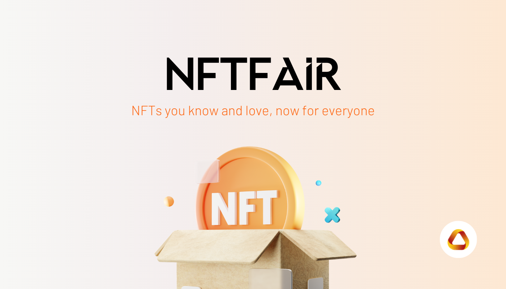

## Overview

{style="zoom:80%"}

It comes as a surprise that NFT launches are hardly fair and hurt the very community built around it. Users have reasonable expectations of obtaining an item from an NFT collection, but instead find that pre-sniping and metadata exploits - where traits are revealed on-chain before the sale - are so common as to be expected. 

It was in light of these current shortcomings that we sat down and deliberated on what a viable solution could be, and how it would look like. It was clear to us that fairness would be a crucial part of such a design. With the support of [Conveyor](https://conveyor.ata.network), [NFTFair](https://www.nftfair.app) was launched. 

## Features

- Unexploitable fairness
  Powered by Conveyor to ensure that metadata is not revealed before the NFT is bought and settled
- True randomness
  Random numbers directly generated from Silicon, with the option of utilizing Verifiable Random Function 
- Multi-chain support
  EVM/WASM compatible, with support for major ecosystem blockchains such as Ethereum, BSC, and Polygon
- Gasless transactions
  Intuitive experience to eliminate user friction and complexity 

## (FIFO) Fairdrops

Attackers with a technical edge can skip ahead of the queue and interact directly with the smart contract of a new collection. The rarest NFTs are snapped up before the average user has a chance to connect their wallet once the sale goes public. For an effective launch process, metadata cannot be revealed at any point of the NFT journey from bidding, selection to distribution. 

With NFTFair, first-in-first-out ordering enforced by Conveyor removes any room for exploitation. 

## Mystery Boxes

Users anticipate the excitement of not knowing the exact item and rarity of an item when they participate in a mystery box collection. The surprise, however, can turn sour, when distribution is not truly randomized. The assumption that each user has an equal opportunity to mint an NFT with random metadata is just that.

AT NFTFair, no one, including the hosting nodes, is able to glean the ordering before it has been decided. It is out of the question for anyone to favor bids based on undisclosed information, which ensures randomization.

## Templates
NFTFair currently supports:

- FIFO (First-In-First-Out) Fairdrops
- Mystery Boxes Fairdrops 

More curated template versions coming soon. 

## Network:

NFTFair is compatible with most EVM networks, and is live on: 

- BSC
- Polygon 

We are also working hard to expand the list of supported networks. Share your project with us [here](https://docs.google.com/forms/d/e/1FAIpQLScU36yLYWuiL3gXVvy7NwvnY-t4JD0u6XUvhTeaogCzQDzQpw/viewform) or drop us a [message](mailto:nftfair@ata.network).

## Category
A category is what defines a collection of NFTs. Properties that can be configured include: 

- NFT Contract
- Range of Token IDs
- Sales Price
- Maximum Purchase/Claim Limit

Projects must define at least one category before sending NFTs to Fairdrop vaults.

## Sales
Prices can be set for NFTs in different categories (i.e. collections). Proceeds from the sale can be withdrawn from the platform once the launch has ended. 

As each Fairdrop vault only accepts a single ERC20 payment token, it is not possible to price Category A at 100 USDC, and Category B at 100 BTC. Projects can choose to price different categories for varying amounts of the same token. For example, Category A at 100 UDSC and Category B at 1000 USDC. 

## Costs
NFT launches on the platform are performed with gasless transactions. For users to benefit from zero-cost transactions, projects may choose to opt for relayer-sponsored transactions. Projects bear the full gas cost and users do not have to pay for any transaction fees. 

Please reach out to [us](mailto:nftfair@ata.network) for more cost details. 

## To get started 
Make sure you have the below information ready: 

- Activity name. Example: Automata NFT Egg Hunt

- Page title. Example: Come and crack your own egg! 

- Start and end time for the Fairdrop

- Official website and social media links 

- Short description to introduce your project. (Example: Automata NFT Egg Hunt is a mystery box competition launched and hosted on NFTFair to celebrate the spirit of Easter with the community.)

- List of commmon FAQs 

- A horizontal brand logo, more than 200px. [Example](https://ipfs.io/ipfs/bafybeihapvgs3ifvv5ts3soxpkez37yo6dln6smlza3smpjjj7dktk7fta/supercar-logo.png)

- A square brand logo, more than 500px. [Example](https://ipfs.io/ipfs/bafybeie5adkgmljzx7qzeulnwnq3laqsne4w5myic6c75kk2sqviqdjtua/supercar-icon.png)

- A banner related to the theme of the Fairdrop, 2132 x 224px. [Example](https://ipfs.io/ipfs/bafybeicywiylhs2w6jfofgzhaw3gfnl2pen2u4wgsrmxuu7crlx46uilbe/supercar-banner.jpeg)

- A favicon for the browser tab, 32 x 32px. [Example](https://static.wixstatic.com/media/0653dd_303a21ade8b64ed5bca9f2755b2cb4a5~mv2.png/v1/fill/w_32%2Ch_32%2Clg_1%2Cusm_0.66_1.00_0.01/0653dd_303a21ade8b64ed5bca9f2755b2cb4a5~mv2.png)

Once the setup is complete, projects can then transfer or mint the NFTs to the Fairdrop Vaults. If you wish to enable the wallet connect function with your infura id, please share the id with us. Read more about [Wallet Connect](https://walletconnect.com/) and [Infura ID](https://infura.io/).
